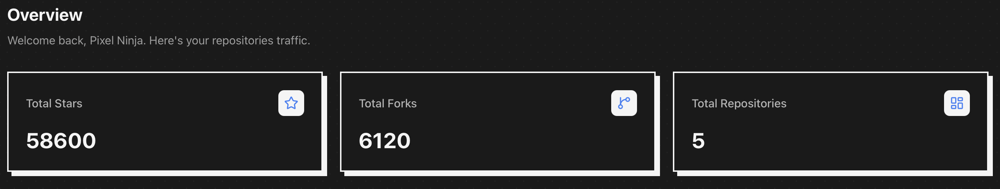
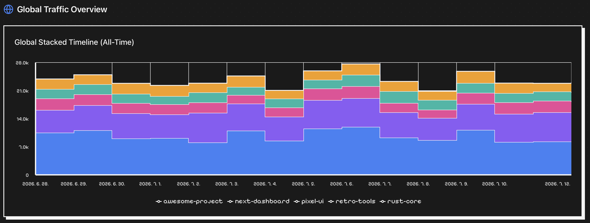
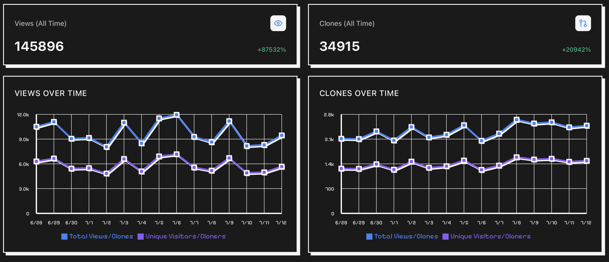
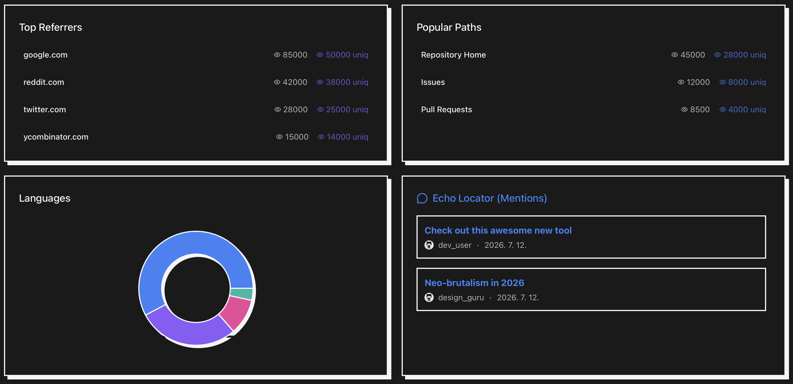

# 📊 Repo-rter

[🇺🇸 English](README.md) | [🇰🇷 한국어](README.ko.md) | [🇨🇳 中文](README.zh.md) | [🇮🇳 हिन्दी](README.hi.md) | [🇪🇸 Español](README.es.md) | [🇫🇷 Français](README.fr.md) | [🇸🇦 العربية](README.ar.md) | [🇷🇺 Русский](README.ru.md) | [🇵🇹 Português](README.pt.md) | [🇮🇩 Bahasa Indonesia](README.id.md) | [🇩🇪 Deutsch](README.de.md) | [🇯🇵 日本語](README.ja.md)

---

<div align="center">
  

  <h3>أداة جميلة لتحليل زيارات GitHub مبنية باستخدام Tauri و Next.js.</h3>

  [](https://www.producthunt.com/products/reporter-2)
  [](https://github.com/RAKKUNN/Repo-rter/releases)
  [](https://github.com/RAKKUNN/Repo-rter/stargazers)
  [](https://github.com/RAKKUNN/Repo-rter/blob/main/LICENSE)
  [](https://github.com/RAKKUNN/Repo-rter/releases)
</div>

<br />

## 📸 Screenshots

| Dashboard Overview | Global Traffic Timeline |
| :---: | :---: |
|  |  |
| **Repository Details** | **Analytics Breakdown** |
|  |  |

## 📖 حول Repo-rter
يوفر GitHub بيانات لمدة 14 يومًا فقط. تعمل هذه الأداة في الخلفية لحفظ بياناتك بلا حدود.

## 🚀 الميزات
- 📈 تتبع زيارات بلا حدود
- 🎨 واجهة مستخدم بكسل
- 🔄 مزامنة في الخلفية
- 💾 تصدير إلى CSV و JSON
- 🌐 يدعم 12 لغة

## 🛠️ التكنولوجيا
- **Frontend**: Next.js
- **Backend**: Tauri

## ⬇️ التثبيت
حمل التطبيق من صفحة [Releases](https://github.com/RAKKUNN/Repo-rter/releases/latest).

## 💻 التطوير المحلي

### المتطلبات الأساسية
- Node.js (v18+)
- Rust

### التثبيت
```bash
git clone https://github.com/RAKKUNN/Repo-rter.git
cd Repo-rter
npm install
npm run tauri dev
```

## ❤️ دعم
يرجى التفكير في [رعايتي على GitHub](https://github.com/sponsors/RAKKUNN)!

## 📝 Changelog

### v0.4.1
- Added custom Data Retention Policy settings (auto-purging old traffic history).
- Dynamically synchronized version strings inside the Settings About panel with package configuration.

### v0.4.0
- Migrated traffic cache from `localStorage` to native OS file storage (safe from system cache purges).
- Added JSON backup data import feature to restore stats across devices.
- Improved background sync with sliding-window repository rotation (safely syncs all repositories over time).
- Refactored documentation and project structure for production-ready open-source packaging.

### v0.3.0
- Added release asset download statistics tracking.
- Added Markdown report exporting (views, clones, referrers, paths, languages).

### v0.2.0
- Initial open-source release.
- Core traffic tracking (views, clones, paths, referrers).
- Multi-language support (12 languages).
- Neo-Brutalist UI and system tray background syncing.
