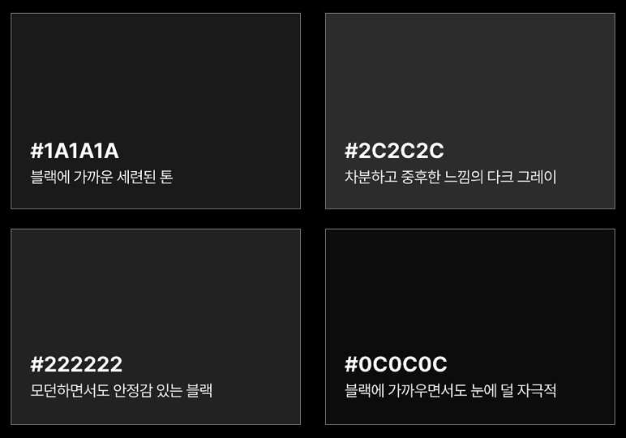

# 📊 Repo-rter

[🇺🇸 English](README.md) | [🇰🇷 한국어](README.ko.md) | [🇨🇳 中文](README.zh.md) | [🇮🇳 हिन्दी](README.hi.md) | [🇪🇸 Español](README.es.md) | [🇫🇷 Français](README.fr.md) | [🇸🇦 العربية](README.ar.md) | [🇷🇺 Русский](README.ru.md) | [🇵🇹 Português](README.pt.md) | [🇮🇩 Bahasa Indonesia](README.id.md) | [🇩🇪 Deutsch](README.de.md) | [🇯🇵 日本語](README.ja.md)

---

A beautiful, neo-brutalist / pixel-art GitHub traffic analytics tool built with Tauri and Next.js.


<br/>


## 📖 About Repo-rter
GitHub only provides 14 days of traffic analytics for your repositories. Repo-rter solves this by continuously running in the background of your desktop to infinitely track and store your repository views, clones, and stars locally. You never lose your data again!

## 🚀 Features
- 📈 Track GitHub traffic infinitely (bypassing the 14-day limit)
- 🎨 Neo-brutalist / Pixel-art UI
- 🔄 Desktop app with system tray & background syncing via Cron
- 💾 Export data to CSV and JSON
- 🌐 Supports 12 languages

## 🛠️ Technology Stack
- **Frontend**: Next.js (Static Export), React, TailwindCSS
- **Backend**: Tauri (Rust)
- **State Management**: React Query with offline local storage caching
- **Deployment**: GitHub Actions for cross-platform automated release building

## 💻 Getting Started (Local Development)

To run the app locally:

```bash
npm install
npm run tauri dev
```

## ❤️ Support
If you find this project useful, please consider [sponsoring me on GitHub](https://github.com/sponsors/RAKKUNN) or starring the repository!
